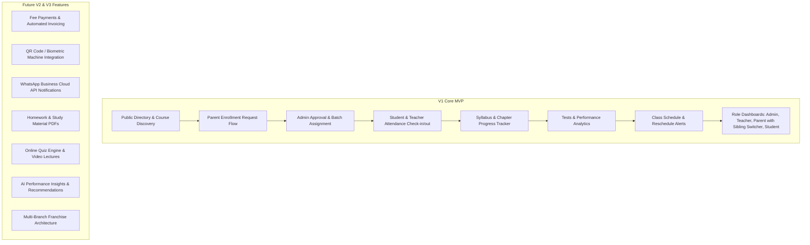

# Success Mentor — Complete Master Project Plan & Architecture

**Success Mentor** is a dedicated education and institute management platform designed specifically for local tuition and coaching centers teaching **Classes 1 to 10**, bridging the communication and visibility gap between coaching institutes, parents, students, and teachers.

---

## 1. Verified Tech Stack Confirmation

> [!IMPORTANT]
> **Exact Tech Stack in Your Codebase**:
> - **Backend**: **Node.js + Express.js (v5.1.0, ES Modules `"type": "module"`)** with **MongoDB & Mongoose (v8.15.1)**. *(Not NestJS, Not Next.js)*.
>   - Dependencies: `express`, `mongoose`, `jsonwebtoken`, `bcrypt`, `cors`, `dotenv`, `nodemon`.
>   - Architecture: Clean domain structure (`Config/`, `Model/`, `Controller/`, `Routes/`, `Middleware/`, `Utils/` with `Academic`, `People`, `Operations` domains).
> - **Frontend**: **React 18 (v18.3.1) + Tailwind CSS (v3.4.17) + Lucide Icons + React Router DOM (v6.28.0) + Axios (v1.7.9)**.
>   - Color Palette: Gold/Amber (`#d49539`), Deep Slate/Navy (`#304b62`), Sand (`#f6d6a0`), Crisp Slate.
>   - Architecture: Clean functional components in `src/pages/`, `src/Components/`, `src/Context/`, `src/api/`.

---

## 2. Product Definition & Core Problem Statement

### 2.1 The Core Problem
Local tuition centers and coaching institutes (Classes 1–10) face frequent operational friction:
1. **Zero Real-Time Visibility for Parents**: Parents have no verified log of whether their child safely arrived at coaching, attended classes, or left on time.
2. **Syllabus & Progress Black Box**: Parents rarely know which chapters are being taught, what has been completed, or what is lagging behind school exams.
3. **Scattered Communication & Untracked Performance**: Test marks, schedule changes, and sudden holiday announcements are lost in informal WhatsApp chats with no historical records.
4. **Institute Administrative Burden**: Coaching owners rely on manual paper registers, leading to lost attendance records, unstructured syllabus tracking, and repetitive phone calls from parents.

### 2.2 Target Audience & User Personas

| Persona | Role | Primary Needs / Pain Points |
| :--- | :--- | :--- |
| **P1: Parent (e.g., Sunita - Working Mother)** | Primary Consumer | Needs real-time check-in/out alerts, syllabus completion %, upcoming test schedule, verified marks, sibling switcher, and direct teacher profile. |
| **P2: Student (e.g., Aarav - Class 9 CBSE)** | Secondary Consumer | Needs daily class timetable, pending topics, upcoming tests, and past performance history. |
| **P3: Teacher / Tutor (e.g., Rajesh Sir - Math Tutor)** | Content & Attendance Manager | Quick 1-click batch attendance, chapter/topic completion marker, test score entry, and batch schedule viewer. |
| **P4: Institute Admin / Owner (e.g., Sharma Coaching)** | Business & Operations Admin | Central dashboard to manage student enrollments, batches, teachers, courses, public directory listing, and attendance audit logs. |
| **P5: Super Admin** | Platform Governance | Platform-wide monitoring, institute onboarding, subscription tiers, and global system health. |

### 2.3 Scope Matrix: MVP (V1) vs. Future Phases



---

## 3. Database Design & Data Dictionary

```mermaid
erDiagram
    INSTITUTE ||--o{ USER : employs_or_registers
    INSTITUTE ||--o{ CLASS : configures
    CLASS ||--o{ SUBJECT : contains
    SUBJECT ||--o{ SYLLABUS : has
    INSTITUTE ||--o{ BATCH : conducts
    BATCH ||--o{ STUDENT : enrolls
    BATCH ||--o{ TEACHER : assigned_to
    BATCH ||--o{ ATTENDANCE : records
    BATCH ||--o{ EXAM : tests
    EXAM ||--o{ RESULT : generates
    PARENT ||--o{ STUDENT : manages
    INSTITUTE ||--o{ ENROLLMENT_INQUIRY : receives
```

### Core Collections:
1. **`Users`**: Common auth table (`email`, `phone`, `password`, `role`, `profile_id`, `institute_id`).
2. **`Institutes`**: Coaching center details (`name`, `slug`, `address`, `classes_offered`, `admin_user_id`).
3. **`Classes` & `Subjects`**: Catalog for Classes 1 to 10 (`Class 1` to `Class 10`) and subjects (Maths, Science, English, etc.).
4. **`Syllabus`**: Rich hierarchical chapter and topic tree with CBSE standard curriculum data.
5. **`Batches`**: Class batches with schedule timing, room, assigned teachers, and enrolled students.
6. **`Students` & `Parents`**: Sibling-aware student profiles linked to a verified parent account.
7. **`Teachers`**: Teacher profiles with subject specializations and batch assignments.
8. **`Attendance`**: Date-wise student check-in/check-out logs, status (`PRESENT`, `ABSENT`, `LATE`, `EXCUSED`), and topics covered.
9. **`Exams` & `Results`**: Unit tests, scorecards, percentages, and teacher remarks.
10. **`Enrollments`**: Inbound admission inquiry submissions with Admin 1-click approval.

---

## 4. Master Execution Roadmap & Flow Index

```
Step 1: Foundational Database Models, Config & CBSE Seeder
   │
   ▼
Step 2: Flow 1 — Public Discovery & Admission Inquiry Flow (01_ADMISSION_INQUIRY_AND_ENROLLMENT_FLOW.md)
   │
   ▼
Step 3: Flow 2 — Teacher Daily Operations & Syllabus Workflow (02_TEACHER_DAILY_WORKFLOW.md)
   │
   ▼
Step 4: Flow 3 — Parent Real-Time Visibility & Multi-Child Portal (03_PARENT_REALTIME_VISIBILITY_FLOW.md)
   │
   ▼
Step 5: Flow 4 — Executive Administration Suite & Dynamic Navbar (04_ADMINISTRATION_AND_PORTAL_NAVIGATION_PLAN.md)
```
