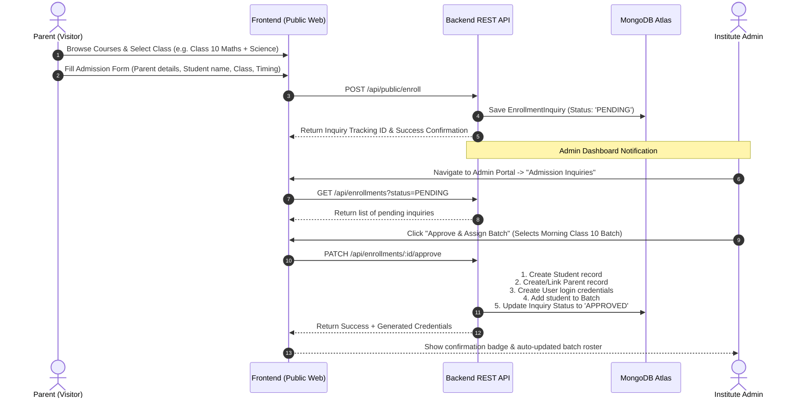

# Flow 1: Admission Inquiry & Student Enrollment (End-to-End Flow)

## 1. Flow Overview & Objective
This flow enables prospective parents and students to discover coaching offerings (Classes 1–10), submit an admission inquiry, and enables Institute Admins to review inquiries, approve them, auto-provision user accounts, and assign students to active batches.

---

## 2. Backend Components for Flow 1

### 2.1 Database Models Needed
- `Model/Operations/Enrollment.js`: Stores inbound inquiries (`parent_name`, `parent_phone`, `parent_email`, `student_name`, `student_class`, `preferred_batch_timing`, `status: 'PENDING'|'APPROVED'|'REJECTED'`).
- `Model/People/Institute.js`: Institute profile and classes offered.
- `Model/Academic/Class.js` & `Subject.js`: Catalog for filtering.
- `Model/People/User.js`, `Parent.js`, `Student.js`, `Batch.js`: For auto-provisioning upon approval.

### 2.2 REST API Endpoints
1. `GET /api/public/courses`: Returns list of classes & subjects offered with fee details.
2. `GET /api/public/institutes/:slug`: Returns institute profile, faculty, and facilities.
3. `POST /api/public/enroll`: Public endpoint to submit admission inquiry.
4. `GET /api/enrollments`: Admin-only endpoint to list pending/approved/rejected inquiries.
5. `PATCH /api/enrollments/:id/approve`: Admin endpoint to approve inquiry, create student/parent account, and assign to a selected batch.
6. `PATCH /api/enrollments/:id/reject`: Admin endpoint with rejection reason.

---

## 3. Frontend Components for Flow 1

### 3.1 Public Pages & Components
- **`src/pages/Courses.jsx`**: Interactive Class filter chips (Classes 1 to 10), Subject filter, and Course Cards with "Apply Now" button.
- **`src/pages/IndividualCourse.jsx`**: Course overview, detailed CBSE syllabus preview, faculty bios, timetable, and "Enroll Now" trigger.
- **`src/Components/EnrollmentModal.jsx`**: Multi-step admission wizard:
  - Step 1: Parent Information (Name, Phone, Email, Address).
  - Step 2: Student Information (Full Name, Current School, Class, DOB, Gender).
  - Step 3: Batch Timing Preference & Submission.
  - Step 4: Instant confirmation screen with Inquiry Reference ID.

### 3.2 Admin Portal Views
- **`src/pages/Admin.jsx` (Admission Pipeline Tab)**:
  - Pending Inquiry Table with badges.
  - Quick Drawer/Modal to select a target batch and click **"Approve & Enroll"**.
  - Immediate reflection in Student Roster and Batch count.
