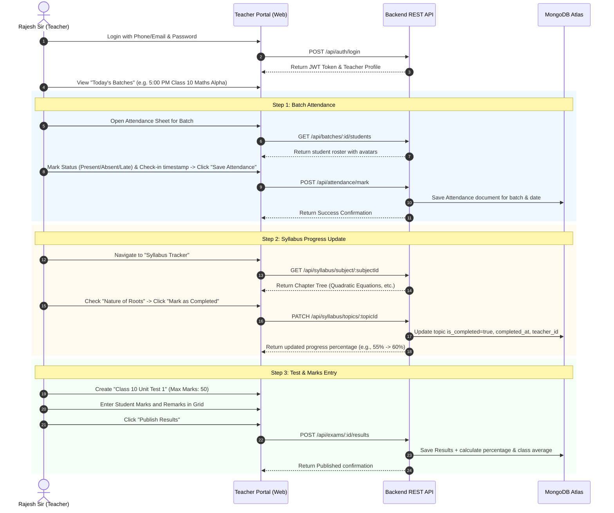

# Flow 2: Teacher Daily Workflow & Syllabus Progress (End-to-End Flow)

## 1. Flow Overview & Objective
This flow provides a friction-free daily workflow for teachers to view their schedule, take fast 1-click batch attendance with timestamps, mark completed syllabus topics in real-time, and publish unit test marks.

---

## 2. Backend Components for Flow 2

### 2.1 Database Models Needed
- `Model/People/Teacher.js`: Teacher profile, qualifications, assigned batches.
- `Model/People/Batch.js`: Batch details, enrolled students, daily schedule.
- `Model/People/Attendance.js`: Date-wise student check-in/out, status (`PRESENT`, `ABSENT`, `LATE`, `EXCUSED`), topic taught.
- `Model/Academic/Syllabus.js`: Chapter and topic hierarchy with completion state.
- `Model/Academic/Exam.js` & `Result.js`: Test definition, max marks, student score records, teacher remarks.

### 2.2 REST API Endpoints
1. `GET /api/teacher/my-batches`: Returns assigned batches, enrolled student count, and today's schedule.
2. `GET /api/batches/:id/students`: Returns enrolled student roster for the batch.
3. `POST /api/attendance/mark`: Records batch session attendance with timestamps and topic covered.
4. `GET /api/syllabus/subject/:subjectId`: Returns full chapters, topics, and completion status.
5. `PATCH /api/syllabus/topics/:topicId`: Marks topic completed/uncompleted with teacher ID and date.
6. `POST /api/exams`: Creates an exam for a batch.
7. `POST /api/exams/:id/results`: Bulk records student marks, absentee flags, and individual teacher remarks.

---

## 3. Frontend Components for Flow 2

### 3.1 Teacher Dashboard Views (`src/pages/TeacherDashboard.jsx`)
1. **Today's Classes Widget**: Quick launch cards for upcoming classes today with start time, room number, and batch size.
2. **1-Click Attendance Sheet (`src/Components/AttendanceSheet.jsx`)**:
   - Table of students with roll numbers and photos.
   - Quick toggles: `Present (P)`, `Absent (A)`, `Late (L)`, `Excused (E)`.
   - Automatic check-in time recorder (default: current time).
   - "Topic Covered Today" input field.
   - "Submit Batch Attendance" button with instant toast notification.
3. **Syllabus Tracker (`src/Components/SyllabusTracker.jsx`)**:
   - Expandable chapters with nested topic checklists.
   - 1-click checkbox to mark topics completed.
   - Live visual progress bar (e.g. 14 of 22 topics completed - 64%).
4. **Test Score Entry Table (`src/Components/TestScoreEntry.jsx`)**:
   - Spreadsheet-style input for fast score entry out of total marks.
   - Optional teacher remark field (e.g. "Excellent problem solving in geometry").
   - 1-click "Publish to Parents" button.
