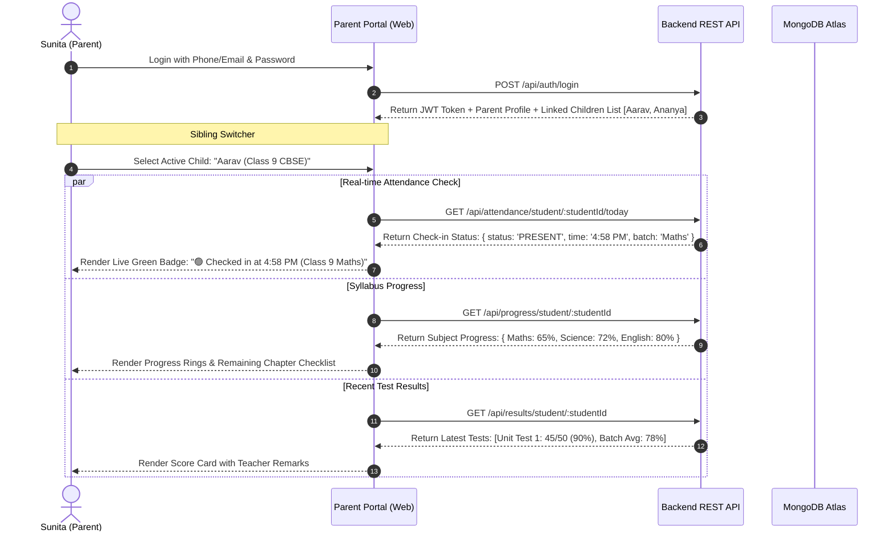

# Flow 3: Parent Real-Time Visibility & Multi-Child Portal (End-to-End Flow)

## 1. Flow Overview & Objective
This flow provides complete transparency to parents (like Sunita). A parent can log in, easily switch between multiple enrolled children (e.g. Aarav in Class 9, Ananya in Class 6), view real-time check-in arrival badges, track subject syllabus completion percentages, check upcoming class schedules, and review test scorecards with teacher feedback.

---

## 2. Backend Components for Flow 3

### 2.1 Database Models Needed
- `Model/People/Parent.js`: Parent profile linked to multiple student IDs (`student_ids: [ObjectId]`).
- `Model/People/Student.js`: Child profile, roll number, class level, enrolled batches.
- `Model/People/Attendance.js`: Real-time session logs with timestamps.
- `Model/Academic/Syllabus.js`: Chapter and topic completion progress.
- `Model/Academic/Result.js` & `Exam.js`: Test scores, grades, percentage, teacher remarks.

### 2.2 REST API Endpoints
1. `GET /api/parent/children`: Fetches all linked children for the logged-in parent.
2. `GET /api/attendance/student/:studentId/today`: Returns today's live arrival status, check-in time, and current class.
3. `GET /api/attendance/student/:studentId/history`: Returns monthly attendance calendar and overall attendance rate (e.g. 96%).
4. `GET /api/progress/student/:studentId`: Returns subject-wise syllabus completion percentages and list of completed vs. pending chapters.
5. `GET /api/results/student/:studentId`: Returns complete scorecard history, marks obtained, percentage, batch average, and teacher remarks.
6. `GET /api/schedule/student/:studentId`: Returns weekly class schedule and any rescheduled class alerts with reasons.

---

## 3. Frontend Components for Flow 3

### 3.1 Parent Dashboard Views (`src/pages/ParentDashboard.jsx`)
1. **Sibling Switcher Header (`src/Components/ChildSwitcher.jsx`)**:
   - Avatar tabs or dropdown displaying child name, class (e.g., "Aarav - Class 9" | "Ananya - Class 6").
   - 1-click active child switch that immediately refreshes all dashboard widgets.
2. **Real-Time Today Widget (`src/Components/TodayStatusCard.jsx`)**:
   - Prominent status card:
     - `🟢 Present: Checked in at 4:58 PM (Class 9 Maths)`
     - `🟡 Late: Checked in at 5:18 PM`
     - `🔴 Absent today`
     - `⚪ No scheduled class today`
3. **Syllabus Progress Rings (`src/Components/SyllabusGauges.jsx`)**:
   - Visual radial progress charts for each enrolled subject.
   - Expandable modal to view exactly which chapters and topics have been covered and what is upcoming.
4. **Recent Test Scorecards (`src/Components/RecentScorecards.jsx`)**:
   - Card view of recent unit tests: Marks obtained / Max marks, percentage badge, batch average comparison, and teacher remarks.
5. **Class Schedule & Reschedule Notice Board (`src/Components/ScheduleCalendar.jsx`)**:
   - Weekly timetable grid.
   - Amber alert banner if a class has been rescheduled with the reason (e.g., "Sunday Maths class moved to 11:00 AM due to teacher illness").
