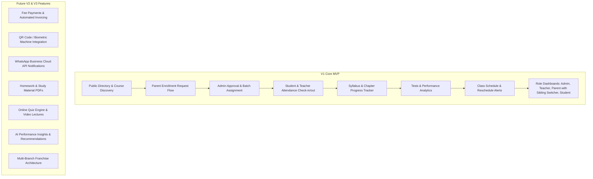

# Success Mentor — Complete Master Project Plan, Architecture & Implementation Roadmap

**Success Mentor** is a dedicated education and institute management platform designed specifically for local tuition and coaching centers teaching **Classes 1 to 10**, bridging the communication and visibility gap between coaching institutes, parents, students, and teachers.

---

## 1. Verified Tech Stack Confirmation

> [!IMPORTANT]
> **Exact Tech Stack in Your Codebase**:
> - **Backend**: **Node.js + Express.js (v5.1.0, ES Modules `"type": "module"`)** with **MongoDB & Mongoose (v8.15.1)**. *(Not NestJS, Not Next.js)*.
>   - Dependencies: `express`, `mongoose`, `jsonwebtoken`, `bcrypt`, `cors`, `dotenv`, `nodemon`.
>   - Architecture: Clean domain structure (`Config/`, `Model/`, `Controller/`, `Routes/`, `Middleware/`, `Utils/` with `Academic`, `People`, `Operations` domains).
> - **Frontend**: **React 18 (v18.3.1) + Tailwind CSS (v3.4.17) + Lucide Icons + React Router DOM (v6.28.0) + Axios (v1.7.9)**.
>   - Color Palette: Gold/Amber (`#d49539`), Deep Slate/Navy (`#304b62`), Sand (`#f6d6a0`), Crisp Slate.
>   - Architecture: Clean functional components in `src/pages/`, `src/Components/`, `src/Context/`, `src/api/`.

---

## 2. Product Definition & Core Problem Statement

### 2.1 The Core Problem
Local tuition centers and coaching institutes (Classes 1–10) face frequent operational friction:
1. **Zero Real-Time Visibility for Parents**: Parents have no verified log of whether their child safely arrived at coaching, attended classes, or left on time.
2. **Syllabus & Progress Black Box**: Parents rarely know which chapters are being taught, what has been completed, or what is lagging behind school exams.
3. **Scattered Communication & Untracked Performance**: Test marks, schedule changes, and sudden holiday announcements are lost in informal WhatsApp chats with no historical records.
4. **Institute Administrative Burden**: Coaching owners rely on manual paper registers, leading to lost attendance records, unstructured syllabus tracking, and repetitive phone calls from parents.

### 2.2 Target Audience & User Personas

| Persona | Role | Primary Needs / Pain Points |
| :--- | :--- | :--- |
| **P1: Parent (e.g., Sunita - Working Mother)** | Primary Consumer | Needs real-time check-in/out alerts, syllabus completion %, upcoming test schedule, verified marks, sibling switcher, and direct teacher profile. |
| **P2: Student (e.g., Aarav - Class 9 CBSE)** | Secondary Consumer | Needs daily class timetable, pending topics, upcoming tests, and past performance history. |
| **P3: Teacher / Tutor (e.g., Rajesh Sir - Math Tutor)** | Content & Attendance Manager | Quick 1-click batch attendance, chapter/topic completion marker, test score entry, and batch schedule viewer. |
| **P4: Institute Admin / Owner (e.g., Sharma Coaching)** | Business & Operations Admin | Central dashboard to manage student enrollments, batches, teachers, courses, public directory listing, and attendance audit logs. |
| **P5: Super Admin** | Platform Governance | Platform-wide monitoring, institute onboarding, subscription tiers, and global system health. |

### 2.3 Scope Matrix: MVP (V1) vs. Future Phases



### 2.4 Primary User Journeys
1. **Public Discovery & Enrollment**:
   `Parent visits homepage` $\rightarrow$ `Filters by Class (e.g. Class 10) and Subject (Maths + Science)` $\rightarrow$ `Views Institute Profile, Fees, Timings` $\rightarrow$ `Submits Student & Parent Details` $\rightarrow$ `Institute receives notification & approves enrollment` $\rightarrow$ `Parent/Student receives login credentials`.
2. **Daily Attendance Flow**:
   `Student enters institute` $\rightarrow$ `Teacher or Admin marks Check-in (with timestamp)` $\rightarrow$ `Parent sees 'Present - Checked in at 4:58 PM' on Dashboard`.
3. **Academic Progress Flow**:
   `Teacher completes 'Quadratic Equations'` $\rightarrow$ `Marks topic 'Completed' in Teacher Portal` $\rightarrow$ `Mathematics Progress advances from 45% to 55%` $\rightarrow$ `Parent and Student view updated progress bar and remaining chapters`.
4. **Test & Score Reporting**:
   `Teacher creates Class 9 Science Unit Test (Max 50 marks)` $\rightarrow$ `Enters scores & remarks` $\rightarrow$ `Publishes result` $\rightarrow$ `Parent receives notification & views score card with batch average comparison`.

---

## 3. Database Design & Data Dictionary

### 3.1 Entity Relationship Diagram

```mermaid
erDiagram
    INSTITUTE ||--o{ USER : employs_or_registers
    INSTITUTE ||--o{ CLASS : configures
    CLASS ||--o{ SUBJECT : contains
    SUBJECT ||--o{ SYLLABUS : has
    INSTITUTE ||--o{ BATCH : conducts
    BATCH ||--o{ STUDENT : enrolls
    BATCH ||--o{ TEACHER : assigned_to
    BATCH ||--o{ ATTENDANCE : records
    BATCH ||--o{ EXAM : tests
    EXAM ||--o{ RESULT : generates
    PARENT ||--o{ STUDENT : manages
    INSTITUTE ||--o{ ENROLLMENT_INQUIRY : receives
```

### 3.2 Detailed Schema Definitions

#### 1. `Institutes` (`Model/People/Institute.js`)
- `_id`: ObjectId
- `name`: String (e.g. "Apex Academy", Indexed)
- `slug`: String (Unique, e.g. "apex-academy")
- `tagline`: String
- `description`: String
- `address`: `{ street: String, city: String, state: String, pincode: String }`
- `contact_email`: String, `contact_phone`: String
- `classes_offered`: [Number] (e.g. `[1, 2, 3, 4, 5, 6, 7, 8, 9, 10]`)
- `banner_url`: String, `logo_url`: String
- `admin_user_id`: ObjectId (Ref: `User`)
- `status`: Enum (`'ACTIVE'`, `'PENDING'`, `'SUSPENDED'`)
- `created_at`, `updated_at`: Timestamps

#### 2. `Users` (`Model/People/User.js`)
- `_id`: ObjectId
- `institute_id`: ObjectId (Ref: `Institute`, nullable for SuperAdmin)
- `name`: String (Required)
- `email`: String (Unique, Indexed)
- `phone`: String (Unique, Indexed)
- `password`: String (Hashed with `bcrypt`)
- `role`: Enum (`'SUPER_ADMIN'`, `'ADMIN'`, `'TEACHER'`, `'PARENT'`, `'STUDENT'`)
- `profile_id`: ObjectId (Ref dynamically to `Teacher`, `Parent`, `Student`, or `Institute`)
- `avatar_url`: String
- `status`: Enum (`'ACTIVE'`, `'INACTIVE'`, `'PENDING'`)
- `created_at`, `updated_at`: Timestamps

#### 3. `ParentProfiles` & `StudentProfiles` (`Model/People/Parent.js`, `Student.js`)
- **Parent**:
  - `user_id`: ObjectId (Ref: `User`)
  - `institute_id`: ObjectId (Ref: `Institute`)
  - `alternate_phone`: String
  - `occupation`: String
  - `address`: String
  - `student_ids`: [ObjectId] (Ref: `Student`)
- **Student**:
  - `user_id`: ObjectId (Ref: `User`)
  - `institute_id`: ObjectId (Ref: `Institute`)
  - `parent_id`: ObjectId (Ref: `Parent`)
  - `roll_no`: String
  - `class_level`: Number (1 to 10)
  - `school_name`: String
  - `gender`: Enum (`'MALE'`, `'FEMALE'`, `'OTHER'`)
  - `dob`: Date
  - `enrolled_batches`: [ObjectId] (Ref: `Batch`)
  - `status`: Enum (`'ACTIVE'`, `'INACTIVE'`, `'GRADUATED'`)

#### 4. `Teachers` (`Model/People/Teacher.js`)
- `user_id`: ObjectId (Ref: `User`)
- `institute_id`: ObjectId (Ref: `Institute`)
- `qualifications`: [String] (e.g. `["B.Sc Mathematics", "B.Ed"]`)
- `specializations`: [String] (e.g. `["Class 9-10 Maths", "Science"]`)
- `experience_years`: Number
- `bio`: String
- `assigned_batches`: [ObjectId] (Ref: `Batch`)

#### 5. `Classes`, `Subjects` & `Syllabus` (`Model/Academic/`)
- **Class** (`Class.js`): `name` ("Class 10"), `class_number` (10), `description`, `institute_id`.
- **Subject** (`Subject.js`): `name` ("Mathematics"), `code` ("MATH10"), `class_id` (Ref: `Class`), `class_number` (10), `color_code`, `institute_id`.
- **Syllabus** (`Syllabus.js`):
  - `subject_id`: Ref `Subject`
  - `class_number`: Number (1-10)
  - `institute_id`: Ref `Institute`
  - `chapters`: `[{ chapter_number: Number, title: String, description: String, total_estimated_hours: Number, topics: [{ topic_id: String, name: String, is_completed: Boolean, completed_at: Date, completed_by_teacher_id: ObjectId }] }]`

#### 6. `Batches` & `Attendance` (`Model/People/Batch.js`, `Attendance.js`)
- **Batch**: `institute_id`, `name`, `class_number`, `subject_ids` [ObjectId], `teacher_ids` [ObjectId], `student_ids` [ObjectId], `schedule`: `[{ day: 'MON'|'TUE'|'WED'|'THU'|'FRI'|'SAT'|'SUN', start_time: String, end_time: String, subject_id: ObjectId, room: String }]`, `monthly_fee`: Number, `status`: `'ACTIVE'`|`'ARCHIVED'`.
- **Attendance**: `institute_id`, `batch_id`, `date`: Date (normalized), `subject_id`: ObjectId, `teacher_id`: ObjectId, `topic_covered`: String, `records`: `[{ student_id: ObjectId, status: 'PRESENT'|'ABSENT'|'LATE'|'EXCUSED', check_in_time: String, check_out_time: String, remarks: String }]`, `marked_by`: ObjectId.

#### 7. `Exams` & `Results` (`Model/Academic/Exam.js`, `Result.js`)
- **Exam**: `institute_id`, `batch_id`, `subject_id`, `title`, `exam_date`: Date, `total_marks`: Number, `passing_marks`: Number, `syllabus_topics`: [String], `status`: `'UPCOMING'`|`'CONDUCTED'`|`'PUBLISHED'`.
- **Result**: `exam_id`, `institute_id`, `student_id`, `marks_obtained`: Number, `is_absent`: Boolean, `grade`: String, `percentage`: Number, `teacher_remarks`: String.

#### 8. `Operations`: `Enrollment`, `Progress`, `Feedback`, `Discipline`, `Notification`
- **Enrollment** (`Model/Operations/Enrollment.js`): `institute_id`, `parent_name`, `parent_phone`, `parent_email`, `student_name`, `student_class`, `preferred_batch_timing`, `status` (`'PENDING'`, `'APPROVED'`, `'REJECTED'`), `converted_student_id`.
- **Progress** (`Model/Operations/Progress.js`): Monthly subject progress snapshot.
- **Notification** (`Model/Operations/Notification.js`): Alerts for Attendance, Test results, Reschedules, Announcements.

---

## 4. REST API Specification

### 4.1 Authentication & Profile APIs
| Method | Endpoint | Purpose | Role Required | Request Body | Response |
| :--- | :--- | :--- | :--- | :--- | :--- |
| `POST` | `/api/auth/register-institute` | Onboard new institute + admin user | Public | `{ institute_name, admin_name, email, phone, password }` | `{ token, user, institute }` |
| `POST` | `/api/auth/login` | Login for all roles | Public | `{ email_or_phone, password }` | `{ token, user, role, profile }` |
| `GET` | `/api/auth/me` | Fetch authenticated user's profile | Authenticated | None | `{ user, profile, permissions }` |
| `POST` | `/api/auth/change-password` | Update account password | Authenticated | `{ current_password, new_password }` | `{ success: true, message }` |

### 4.2 Public Discovery & Enrollment APIs
| Method | Endpoint | Purpose | Role Required | Request Body | Response |
| :--- | :--- | :--- | :--- | :--- | :--- |
| `GET` | `/api/public/institutes` | Search & filter institutes | Public | Query: `?city=&class=&subject=` | `[{ name, slug, address, classes }]` |
| `GET` | `/api/public/institutes/:slug` | Get full institute details & courses | Public | None | `{ institute, courses, teachers }` |
| `POST` | `/api/public/enroll` | Submit admission / enrollment inquiry | Public | `{ parent_name, phone, student_name, class, course_id, batch_pref }` | `{ message, applicationId }` |
| `GET` | `/api/enrollments` | List admission inquiries | Admin | Query: `?status=` | `[EnrollmentApplications]` |
| `PATCH` | `/api/enrollments/:id` | Approve/Reject & convert to student | Admin | `{ status: 'APPROVED', batch_id }` | `{ student, parent, user }` |

### 4.3 Academic & Batch Management APIs
| Method | Endpoint | Purpose | Role Required | Request Body |
| :--- | :--- | :--- | :--- | :--- |
| `GET/POST` | `/api/classes` | List / Create Classes 1 to 10 | Admin, Public | `{ name, class_number, description }` |
| `GET/POST` | `/api/subjects` | List / Create Subjects per Class | Admin, Public | `{ name, code, class_id, class_number }` |
| `GET` | `/api/syllabus/subject/:subjectId` | View full syllabus chapters & topics | Authenticated | None |
| `PATCH` | `/api/syllabus/topics/:topicId` | Mark topic completed/uncompleted | Teacher, Admin | `{ is_completed: true, teacher_id }` |
| `GET/POST` | `/api/batches` | List / Create Batches with Schedule | Admin, Teacher | `{ name, class_number, subject_ids, teacher_ids, schedule }` |
| `POST` | `/api/batches/:id/assign-student` | Add students to batch | Admin | `{ student_ids: [] }` |

### 4.4 Attendance & Schedule APIs
| Method | Endpoint | Purpose | Role Required | Request Body |
| :--- | :--- | :--- | :--- | :--- |
| `POST` | `/api/attendance/mark` | Record batch session attendance & check-in/out | Teacher, Admin | `{ batch_id, date, subject_id, topic_covered, records: [{ student_id, status, check_in_time }] }` |
| `GET` | `/api/attendance/batch/:batchId` | Get historical attendance for batch | Teacher, Admin | Query: `?start_date=&end_date=` |
| `GET` | `/api/attendance/student/:studentId` | Get student attendance history & % | Parent, Student, Admin | Query: `?month=&year=` |
| `POST` | `/api/schedule/reschedule` | Reschedule a class with notification | Admin, Teacher | `{ batch_id, date, new_time, reason }` |

### 4.5 Tests, Progress & Analytics APIs
| Method | Endpoint | Purpose | Role Required | Request Body |
| :--- | :--- | :--- | :--- | :--- |
| `GET/POST` | `/api/exams` | List / Schedule unit tests | Teacher, Admin | `{ batch_id, subject_id, title, exam_date, total_marks, passing_marks }` |
| `POST` | `/api/exams/:id/results` | Submit student marks & remarks | Teacher, Admin | `{ results: [{ student_id, marks_obtained, remarks }] }` |
| `GET` | `/api/results/student/:studentId` | Comprehensive student score history | Parent, Student, Admin | None (Returns exams, marks, percentage trend, avg) |
| `GET` | `/api/progress/student/:studentId` | Combined progress report (Attendance + Syllabus + Tests) | Parent, Student, Admin | None |

---

## 5. UI / UX Portals & Feature Layouts

### 5.1 Public Platform
- **Landing Page (`/`)**: Hero with Class 1–10 selector, value propositions for parents & institutes, live demo link, footer.
- **Course Discovery (`/courses`)**: Filterable course cards by Class (Class 1 to 10) and Subject (Maths, Science, English, etc.) with real backend data.
- **Course Details (`/courses/:id`)**: Full chapter syllabus preview, teacher details, weekly timetable, and "Enroll Child Now" modal.
- **Teachers Directory (`/teachers`)**: Faculty bios, qualifications, and specializations.
- **Login / Register (`/login`, `/signup`)**: Multi-role login with automatic redirect to Admin, Teacher, Parent, or Student dashboard.

### 5.2 Parent Portal (`/parent`)
- **Child Switcher**: Instant dropdown / tabs to switch between enrolled siblings (e.g., Aarav in Class 9, Ananya in Class 6).
- **Today's Status Badge**: Real-time arrival status (`🟢 In Class: Maths (Checked-in 4:58 PM)` / `🔴 Absent`).
- **Syllabus Completion Wheel**: Subject-wise progress (Maths: 65%, Science: 78%).
- **Recent Test Scorecards**: Unit test marks, percentage, batch average, and teacher remarks.
- **Interactive Timetable & Reschedule Notices**: Monthly calendar with color-coded alerts for shifted classes.

### 5.3 Teacher Portal (`/teacher`)
- **Today's Batches & Schedule**: Overview of upcoming classes with batch size and room.
- **1-Click Attendance Sheet**: Quick toggle (Present / Absent / Late) with check-in timestamp recorder.
- **Syllabus Topic Checklist**: 1-click "Mark as Taught Today" advancing the subject progress.
- **Scorecard Entry Sheet**: Fast marks and remarks entry for conducted unit tests.

### 5.4 Institute Admin Dashboard (`/admin`)
- **KPI Overview Cards**: Total Students, Active Batches, Today's Attendance %, Pending Inquiries.
- **Admission Inquiries Pipeline**: 1-Click Approve inquiry $\rightarrow$ creates Student & Parent account $\rightarrow$ assigns to Batch.
- **Batch & Timetable Builder**: Weekly schedule grid with conflict prevention for rooms and teachers.
- **Teacher & Student Directory**: Complete roster management with role controls.

### 5.5 Student Portal (`/student`)
- Daily timetable, pending syllabus chapters, upcoming test countdown, and personal progress graph.

---

## 6. Security, Multi-Tenancy & Critical Edge Cases

1. **Multi-Tenant Data Isolation**:
   - Every database query for institute data is scoped with `institute_id` extracted from verified JWT context.
2. **Parent-Child Authorization Barrier**:
   - Parents are strictly restricted to querying student records that belong to `Parent.student_ids`.
3. **Sibling Handling**:
   - A single parent account can manage multiple children enrolled in different classes with instant 1-click switching.
4. **Teacher Substitution**:
   - Any authorized teacher or admin can log attendance or syllabus updates for a session without breaking the master batch assignment.
5. **Class Reschedule Transparency**:
   - Rescheduled classes retain the original timestamp, reason, and are highlighted in amber on student and parent calendars.

---

## 7. Step-by-Step Execution Roadmap

```
Milestone 1: Backend Core Data Models, Config & CBSE Class 1-10 Seeder
   │
   ▼
Milestone 2: JWT Authentication, Multi-tenant Isolation & RBAC
   │
   ▼
Milestone 3: Academic Engine (Classes 1-10, Subjects, Batches & Syllabus Tracker)
   │
   ▼
Milestone 4: Daily Operations (Batch Attendance, Class Scheduling & Exam/Scorecards)
   │
   ▼
Milestone 5: Frontend Authentication, API Client & Public Website Integration
   │
   ▼
Milestone 6: Dedicated Role Portals (Admin, Teacher, Parent with Multi-Child, Student) & Demo Data Verification
```

---

## 8. Verification Plan

### Automated & API Verification
- Unit & integration verification for:
  - User registration, login, and JWT role verification.
  - CBSE Class 1-10 syllabus seeding.
  - Batch creation & student assignment.
  - Attendance marking & percentage calculation.
  - Exam creation, marks entry, and student scorecard generation.

### End-to-End User Flow Verification
1. **Admission Inquiry Flow**: Public visitor submits enrollment $\rightarrow$ Admin approves $\rightarrow$ Student assigned to batch.
2. **Teacher Daily Workflow**: Teacher logs in $\rightarrow$ marks batch attendance $\rightarrow$ marks syllabus topic completed $\rightarrow$ enters test marks.
3. **Parent Real-Time View**: Parent logs in $\rightarrow$ toggles active child $\rightarrow$ views live check-in badge, updated syllabus %, and test scorecard.
